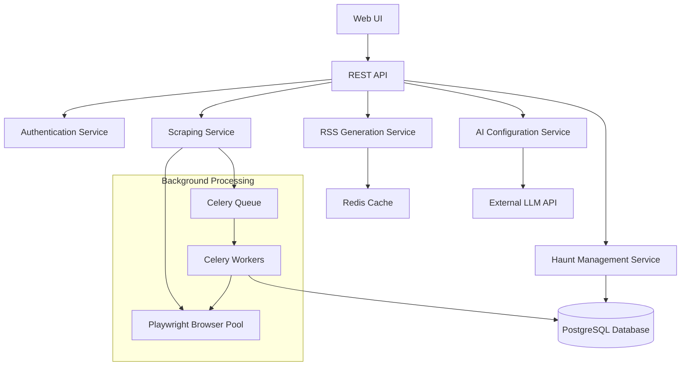
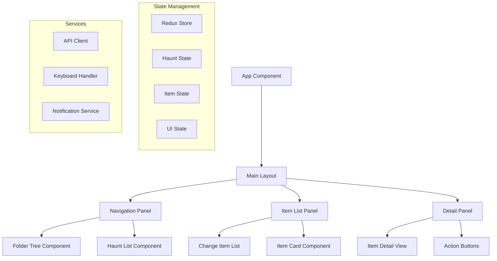

# Design Document

## Overview

The Site Change Watcher is a web application that monitors live websites for user-defined changes and provides RSS feeds and a Reader-style interface. The system uses AI to convert natural language descriptions into monitoring configurations, employs headless browser technology for SPA compatibility, and provides both private and public sharing capabilities.

## Architecture

The system follows a microservices-inspired architecture with clear separation of concerns:



### Core Components

1. **Web Application Layer**: Django-based REST API with React frontend (containerized)
2. **Background Processing**: Celery with Redis broker for scheduled scraping (containerized)
3. **Browser Automation**: Playwright for SPA-compatible scraping (containerized)
4. **Data Storage**: PostgreSQL for structured data, Redis for caching (containerized)
5. **AI Integration**: External LLM API for configuration generation and summaries

### Docker Architecture

The system uses Docker Compose to orchestrate multiple services:

```yaml
services:
  web:        # Django API server
  frontend:   # React development server (dev) / Nginx (prod)
  db:         # PostgreSQL database
  redis:      # Redis for Celery broker and caching
  celery:     # Celery worker processes
  scheduler:  # Celery beat scheduler
```

### Frontend Architecture

The React frontend implements a Google Reader-inspired interface with three main panels:



## Components and Interfaces

### 1. Haunt Management Service

**Purpose**: Manages haunt creation, configuration, and lifecycle

**Key Classes**:
```python
class Haunt(models.Model):
    id = models.UUIDField(primary_key=True)
    owner = models.ForeignKey(User)
    name = models.CharField(max_length=200)
    url = models.URLField()
    description = models.TextField()
    config = models.JSONField()  # Parsed selectors, rules, etc.
    current_state = models.JSONField()  # Current key-value state
    last_alert_state = models.JSONField(null=True)
    alert_mode = models.CharField(choices=['once', 'on_change'])
    scrape_interval = models.IntegerField()  # minutes
    is_public = models.BooleanField(default=False)
    public_slug = models.SlugField(unique=True, null=True)
    created_at = models.DateTimeField(auto_now_add=True)
    updated_at = models.DateTimeField(auto_now=True)
```

**API Endpoints**:
- `POST /api/haunts/` - Create new haunt
- `GET /api/haunts/` - List user's haunts
- `GET /api/haunts/{id}/` - Get haunt details
- `PUT /api/haunts/{id}/` - Update haunt configuration
- `DELETE /api/haunts/{id}/` - Delete haunt
- `POST /api/haunts/{id}/make-public/` - Make haunt public

### 2. AI Configuration Service

**Purpose**: Converts natural language descriptions to structured monitoring configurations

**Key Functions**:
```python
class AIConfigService:
    def generate_config(self, url: str, description: str) -> dict:
        """Generate monitoring configuration from natural language"""
        
    def generate_summary(self, old_state: dict, new_state: dict) -> str:
        """Generate human-friendly change summary"""
```

**Configuration Schema**:
```json
{
  "selectors": {
    "status": "css:.admission-status",
    "deadline": "xpath://span[@class='deadline']"
  },
  "normalization": {
    "status": {
      "type": "text",
      "transform": "lowercase"
    }
  },
  "truthy_values": {
    "status": ["open", "accepting", "available"]
  }
}
```

### 3. Scraping Service

**Purpose**: Executes scheduled scraping using Playwright and detects changes

**Key Classes**:
```python
class ScrapingService:
    def scrape_haunt(self, haunt_id: str) -> dict:
        """Scrape a single haunt and return extracted state"""
        
    def detect_changes(self, haunt: Haunt, new_state: dict) -> bool:
        """Compare new state with current state"""
        
    def should_alert(self, haunt: Haunt, changes: dict) -> bool:
        """Determine if alert should be sent based on alert_mode"""
```

**Celery Tasks**:
```python
@periodic_task(run_every=crontab(minute='*/15'))
def scrape_haunts_15min():
    """Scrape haunts with 15-minute interval"""

@periodic_task(run_every=crontab(minute='*/30'))
def scrape_haunts_30min():
    """Scrape haunts with 30-minute interval"""
```

### 4. RSS Generation Service

**Purpose**: Generates and serves RSS feeds from haunt changes

**Key Classes**:
```python
class RSSItem(models.Model):
    haunt = models.ForeignKey(Haunt)
    title = models.CharField(max_length=300)
    description = models.TextField()
    link = models.URLField()
    pub_date = models.DateTimeField()
    guid = models.CharField(max_length=100, unique=True)

class RSSService:
    def generate_feed(self, haunt: Haunt) -> str:
        """Generate RSS XML for a haunt"""
        
    def add_change_item(self, haunt: Haunt, changes: dict, summary: str = None):
        """Add new RSS item for detected change"""
```

**RSS Endpoints**:
- `GET /rss/private/{haunt_id}/` - Private RSS feed (requires auth)
- `GET /rss/public/{public_slug}/` - Public RSS feed
- `GET /api/haunts/{id}/rss-url/` - Get RSS URL for haunt

### 5. Subscription Service

**Purpose**: Manages user subscriptions to public haunts

**Key Classes**:
```python
class Subscription(models.Model):
    user = models.ForeignKey(User)
    haunt = models.ForeignKey(Haunt)
    subscribed_at = models.DateTimeField(auto_now_add=True)
    
class UserReadState(models.Model):
    user = models.ForeignKey(User)
    rss_item = models.ForeignKey(RSSItem)
    is_read = models.BooleanField(default=False)
    is_starred = models.BooleanField(default=False)

class Folder(models.Model):
    user = models.ForeignKey(User)
    name = models.CharField(max_length=100)
    parent = models.ForeignKey('self', null=True, blank=True)
    created_at = models.DateTimeField(auto_now_add=True)
    
    class Meta:
        unique_together = ['user', 'name', 'parent']
```

### 6. Frontend Components

**Purpose**: React components implementing the Google Reader-style interface

**Key Components**:

```typescript
// Main Layout Component
interface MainLayoutProps {
  user: User;
  selectedHaunt: Haunt | null;
  selectedItem: RSSItem | null;
}

// Navigation Panel
interface NavigationPanelProps {
  folders: FolderTree[];
  haunts: Haunt[];
  unreadCounts: Record<string, number>;
  onHauntSelect: (haunt: Haunt) => void;
  onFolderToggle: (folderId: string) => void;
}

// Item List Panel
interface ItemListPanelProps {
  items: RSSItem[];
  selectedItem: RSSItem | null;
  onItemSelect: (item: RSSItem) => void;
  onItemRead: (item: RSSItem) => void;
  onItemStar: (item: RSSItem) => void;
}

// Item Detail Panel
interface ItemDetailPanelProps {
  item: RSSItem | null;
  onVisitSite: (url: string) => void;
  onMarkRead: (item: RSSItem) => void;
  onStar: (item: RSSItem) => void;
}

// Setup Wizard Component
interface SetupWizardProps {
  onComplete: (haunt: HauntConfig) => void;
  onCancel: () => void;
}
```

**State Management**:
```typescript
interface AppState {
  haunts: {
    items: Haunt[];
    folders: Folder[];
    selectedHaunt: Haunt | null;
    loading: boolean;
  };
  rssItems: {
    items: RSSItem[];
    selectedItem: RSSItem | null;
    unreadCounts: Record<string, number>;
    loading: boolean;
  };
  ui: {
    leftPanelWidth: number;
    middlePanelWidth: number;
    showSetupWizard: boolean;
    keyboardShortcutsEnabled: boolean;
  };
}
```

## Data Models

### Core Entities

1. **User**: Standard Django user model with authentication
2. **Haunt**: Main entity representing a monitored site
3. **RSSItem**: Individual feed items generated from changes
4. **Subscription**: User subscriptions to public haunts
5. **UserReadState**: Per-user read/star state for RSS items

### State Storage Strategy

The system stores minimal state to enable efficient change detection:

```json
{
  "current_state": {
    "status": "open",
    "deadline": "2024-03-15",
    "last_updated": "2024-01-15T10:30:00Z"
  },
  "last_alert_state": {
    "status": "closed",
    "deadline": "2024-03-15"
  }
}
```

### Database Schema Considerations

- Use UUID primary keys for haunts to prevent enumeration
- Index on `owner`, `is_public`, `scrape_interval` for efficient queries
- Partition RSS items by date for performance
- Use database-level constraints for data integrity
- Add folder hierarchy support with self-referencing foreign keys
- Index on folder relationships for efficient tree queries
- Add composite indexes for user-specific queries (user + folder, user + haunt)

### Extended Data Models

**Folder Management**:
```python
# Add to Haunt model
class Haunt(models.Model):
    # ... existing fields ...
    folder = models.ForeignKey(Folder, null=True, blank=True)
```

**UI State Tracking**:
```python
class UserUIPreferences(models.Model):
    user = models.OneToOneField(User)
    left_panel_width = models.IntegerField(default=250)
    middle_panel_width = models.IntegerField(default=400)
    keyboard_shortcuts_enabled = models.BooleanField(default=True)
    auto_mark_read_on_scroll = models.BooleanField(default=False)
    collapsed_folders = models.JSONField(default=list)
```

## Error Handling

### Scraping Failures

1. **Timeout Handling**: Implement progressive timeouts (30s, 60s, 120s)
2. **Network Errors**: Retry with exponential backoff (max 3 attempts)
3. **Selector Failures**: Log missing elements, continue with available data
4. **JavaScript Errors**: Capture console errors, attempt graceful degradation

### AI Service Failures

1. **LLM API Errors**: Fallback to manual configuration mode
2. **Rate Limiting**: Queue requests with backoff strategy
3. **Invalid Configurations**: Validate generated configs before saving

### Data Consistency

1. **Concurrent Updates**: Use database transactions and optimistic locking
2. **State Corruption**: Implement state validation and recovery mechanisms
3. **RSS Feed Integrity**: Ensure atomic updates to RSS items

## Testing Strategy

### Unit Testing

- **Model Tests**: Validate data models, constraints, and business logic
- **Service Tests**: Test individual service methods with mocked dependencies
- **Utility Tests**: Test configuration parsing, normalization, and validation

### Integration Testing

- **API Tests**: Test REST endpoints with real database
- **Scraping Tests**: Test Playwright integration with mock websites
- **Celery Tests**: Test task execution and scheduling
- **RSS Tests**: Validate RSS XML generation and feed integrity

### End-to-End Testing

- **User Workflows**: Test complete haunt creation and monitoring flows
- **Browser Compatibility**: Test scraping across different SPA frameworks
- **Performance Tests**: Load testing for concurrent scraping operations

### Test Data Strategy

- **Mock Websites**: Create test sites with known change patterns
- **LLM Mocking**: Mock AI responses for consistent testing
- **Time-based Testing**: Use freezegun for testing scheduled operations

## User Interface Design

### Three-Panel Layout

The main interface follows the classic Google Reader layout:

```
┌─────────────┬─────────────────┬─────────────────┐
│             │                 │                 │
│ Navigation  │   Item List     │  Item Detail    │
│             │                 │                 │
│ • Folders   │ ┌─────────────┐ │ Change Summary  │
│   - Jobs    │ │ Status:     │ │                 │
│   - School  │ │ OPEN→CLOSED │ │ Link to site    │
│             │ │ 2 hours ago │ │                 │
│ • All Items │ │ [unread][⭐] │ │ AI Summary      │
│             │ └─────────────┘ │                 │
│ • Starred   │                 │ Timeline        │
│             │ ┌─────────────┐ │ (optional)      │
│             │ │ Next item   │ │                 │
│             │ └─────────────┘ │                 │
└─────────────┴─────────────────┴─────────────────┘
```

### Component Specifications

**Navigation Panel (Left)**:
- Collapsible folder tree with unread count badges
- "All Items" and "Starred" virtual folders
- Drag-and-drop support for organizing haunts
- Context menu for folder/haunt management
- Search/filter functionality

**Item List Panel (Middle)**:
- Compact item cards showing status changes
- Visual indicators for read/unread state
- Star icons for favorited items
- Time-based sorting (newest first)
- Infinite scroll or pagination
- Keyboard navigation support

**Item Detail Panel (Right)**:
- Full change summary with before/after values
- "Visit Site" button opening in new tab
- AI-generated summary (when available)
- Timeline of historical changes
- Mark read/unread and star/unstar actions
- Responsive design for smaller screens

### Setup Wizard Design

Multi-step wizard for haunt creation:

1. **URL Input**: URL validation and site preview
2. **Description**: Natural language description with examples
3. **Configuration**: Folder selection, schedule, alerts, privacy
4. **Preview**: Test scrape results with extracted data
5. **Confirmation**: Final review before creation

### Keyboard Shortcuts

- `J/K`: Navigate items up/down
- `M`: Toggle read/unread
- `S`: Toggle star/unstar
- `R`: Refresh current haunt
- `N`: Create new haunt
- `?`: Show keyboard shortcuts help
- `Esc`: Close modals/wizards

## Security Considerations

### Authentication & Authorization

- JWT-based authentication for API access
- Role-based permissions for haunt management
- Rate limiting on API endpoints and RSS feeds

### Data Privacy

- Private haunts isolated by user ownership
- Public haunt data sanitization
- Secure storage of user credentials and API keys

### Scraping Ethics

- Respect robots.txt files
- Implement reasonable rate limiting
- User-agent identification
- Terms of service compliance checking

## Performance Optimization

### Caching Strategy

- Redis caching for RSS feeds (TTL: 15 minutes)
- Database query optimization with proper indexing
- CDN for static assets and public RSS feeds

### Scalability Considerations

- Horizontal scaling of Celery workers
- Database read replicas for RSS generation
- Browser pool management for Playwright instances
- Queue partitioning by scrape interval

### Monitoring & Observability

- Application metrics (scrape success rates, response times)
- Error tracking and alerting
- Performance monitoring for database queries
- Resource usage monitoring for browser instances