# Watcher - Site Change Monitoring

> **Haunt the web. Stay informed.**

A site change monitoring application that "haunts" websites to detect user-defined changes and provides RSS feeds with a Google Reader-style interface.

<details>
<summary><strong>📑 Table of Contents</strong> (click to expand)</summary>

- [What is Watcher?](#what-is-watcher)
  - [What Does "Haunting" Mean?](#what-does-haunting-mean)
- [Key Features](#key-features)
  - [🤖 AI-Powered Setup](#-ai-powered-setup)
  - [👻 Intelligent Monitoring](#-intelligent-monitoring)
  - [📰 Google Reader-Inspired Interface](#-google-reader-inspired-interface)
  - [🌐 Public Sharing & Subscriptions](#-public-sharing--subscriptions)
- [How Watcher Relates to Google Reader](#how-watcher-relates-to-google-reader)
- [How AI Powers Watcher](#how-ai-powers-watcher)
- [Installation](#installation)
  - [Prerequisites](#prerequisites)
  - [Step-by-Step Setup](#step-by-step-setup)
  - [Quick Start (TL;DR)](#quick-start-tldr)
- [Configuration](#configuration)
  - [Required Environment Variables](#required-environment-variables)
  - [Google Gemini API Setup](#google-gemini-api-setup)
- [Mock Data & Demo Setup](#mock-data--demo-setup)
  - [Public Haunts](#public-haunts-available-to-all-users)
  - [Demo Data for Testing](#demo-data-for-testing)
  - [Quick Verification](#quick-verification)
- [Useful Scripts](#useful-scripts)
- [Development](#development)
- [Troubleshooting](#troubleshooting)
- [API Endpoints](#api-endpoints)
  - [Authentication](#authentication)
  - [Haunt Management](#haunt-management)
  - [Subscription Management](#subscription-management)
  - [Folder Management](#folder-management)
- [Architecture](#architecture)

</details>

## What is Watcher?

Watcher monitors websites for changes you care about—like a friendly ghost watching over pages 24/7. When something meaningful changes, you get notified via email or can check updates in the familiar Google Reader-inspired interface.

https://github.com/user-attachments/assets/d7660125-0035-4a63-8766-f63b7dcbe5f4

### What Does "Haunting" Mean?

When you **haunt a website**, Watcher becomes your invisible observer—silently watching a page for the changes you care about. Like a friendly ghost, it monitors 24/7 without being seen, then alerts you the moment something important happens.

**Examples:**
- 💼 Haunt a job board to catch new postings the second they appear
- 🎓 Haunt a course page to grab a spot when enrollment opens
- 🛍️ Haunt a product page to buy when it's back in stock
- 🚀 Haunt a deployment dashboard to track service health

## Key Features

### 🤖 AI-Powered Setup
- **Natural Language Configuration**: Just say "monitor the price" or "watch for new posts"—AI figures out the technical details
- **Smart Change Detection**: AI understands context and only alerts you to meaningful changes, not every pixel update
- **Contextual Summaries**: Each alert includes an AI-generated summary explaining what changed and why it matters
- **No Coding Required**: Describe what you want in plain English; AI generates CSS selectors and scraping rules

### 👻 Intelligent Monitoring
- **Modern Web Compatible**: Uses Playwright headless browser to handle JavaScript-heavy single-page applications
- **Flexible Scheduling**: Check sites every 15 minutes, 30 minutes, hourly, or daily
- **Intent-Based Alerts**: AI evaluates if changes match your monitoring intent
- **Email Notifications**: Get alerts in your inbox when changes are detected
- **Manual Refresh**: Trigger immediate checks when you need them

### 📰 Google Reader-Inspired Interface
- **Three-Panel Layout**: Familiar navigation → feed list → content hierarchy
- **Keyboard Shortcuts**: Navigate with J/K, mark read with M, star with S
- **RSS Integration**: Generate RSS feeds for use with any feed reader
- **Folder Organization**: Group related monitors into hierarchical folders
- **Clean, Information-Dense Design**: Minimal UI that gets out of your way

### 🌐 Public Sharing & Subscriptions
- **Share Configurations**: Make your haunts public for others to use
- **One-Click Subscribe**: Subscribe to public haunts without creating your own
- **Community Benefit**: Browse and use monitoring configurations created by others
- **Independent Tracking**: Track your own read/unread status for subscribed haunts

## How Watcher Relates to Google Reader

### What's the Same ✓
- **Three-panel layout** for efficient information consumption
- **Keyboard shortcuts** (J/K/M/S) for power users
- **Clean, information-dense design** with subtle colors and thin borders
- **RSS feed generation** for integration with other readers
- **Folder organization** for grouping related items
- **Unread/read tracking** with visual indicators

### What's Different ⚡
- **Automatic website monitoring** instead of just RSS feed aggregation
- **AI-powered setup** converts natural language to technical selectors
- **Smart change detection** filters out noise, only alerts on meaningful changes
- **Email notifications** for immediate awareness
- **Modern SPA support** using real browser automation (Playwright)
- **Public haunt sharing** for community-created monitoring configurations

**In essence:** Same beloved interface. New superpower: haunting any website.

## How AI Powers Watcher

Watcher uses **Google Gemini 2.0 Flash** for three key capabilities:

### 1. Natural Language to Code
Say "watch the price in the product details" and AI generates:
- CSS selectors to find the right elements
- XPath expressions for complex structures
- Normalizatint Read States**: Track your own read/unread status for subscribed haunts
- **Subscription Management**: Subscribe and unsubscribe from public haunts at any time
- **Pre-configured Haunts**: 6 public haunts available immediately on first startup

## Quick Deploy to AWS ☁️

Deploy Watcher to AWS ECS Fargate with CloudFront CDN in under 30 minutes:

```bash
cd deployment
bash fast-deploy.sh
```

**What you get:**
- Production-ready infrastructure (VPC, RDS PostgreSQL, Redis, ECS, ALB, CloudFront)
- 4 ECS Fargate services (backend, frontend, celery worker, celery beat)
- Demo data pre-populated with 6 public haunts
- CloudFront CDN for global access
- **Cost**: ~$110/month

**Demo credentials:**
- Email: `demo@watcher.local`
- Password: `demo123`

📖 **Full deployment guide**: [`deployment/START_HERE.md`](deployment/START_HERE.md)

---

## Local Development Setup

### Prerequisites

- Docker and Docker Compose installed
- Google Gemini API key from [AI Studio](https://aistudio.google.com/app/apikey)

### Quick Start

```bash
# 1. Clone and setup environment
cp .env.example .env
# Edit .env and add your LLM_API_KEY

# 2. Start local development (hot reload enabled)
docker-compose up -d

# 3. Run migrations and setup demo data
docker-compose exec web python manage.py populate_demo_data

# 4. Access the application
# Frontend: http://localhost:3000
# Backend API: http://localhost:8000/api/v1
# Django Admin: http://localhost:8000/admin
```

**Demo credentials:** `demo@watcher.local` / `demo123`

### Local vs Production Configurations

Watcher has **two separate Docker configurations** to ensure your local development doesn't break when deploying to production:

#### Local Development (`docker-compose.yml`)
- **Frontend**: Uses `Dockerfile.dev` with React dev server
- **Hot reload**: Code changes reflect immediately via volume mounts
- **Debug mode**: Enabled for easier development
- **Ports**: Frontend 3000, Backend 8000, DB 5432, Redis 6379
- **Use for**: Day-to-day development work

#### Production (`docker-compose.prod.yml` and AWS)
- **Frontend**: Uses production `Dockerfile` with nginx serving optimized static build
- **Optimized**: Minified assets, production Django settings
- **Debug mode**: Disabled
- **Ports (local test)**: Frontend 80, Backend 8000, DB 5433, Redis 6380
- **Use for**: Testing production build locally before AWS deployment

### Testing Production Build Locally

Before deploying to AWS, test the production build on your machine:

```bash
# Start production-like environment
docker-compose -f docker-compose.prod.yml up -d

# Run migrations and setup
docker-compose -f docker-compose.prod.yml exec web python manage.py populate_demo_data

# Access at http://localhost (port 80)
# Backend API: http://localhost:8000/api/v1

# Stop when done
docker-compose -f docker-compose.prod.yml down
```

### Why Two Configurations?

- **Development needs hot reload** for fast iteration - the React dev server watches files and reloads instantly
- **Production needs optimization** - static builds are minified, cached, and served by nginx
- **Separate configs prevent deployment issues** - what works locally will work in production

## Configuration

### Required Environment Variables

The application requires several environment variables to be configured in your `.env` file:

- `LLM_API_KEY` - **Required**: Your Google Gemini API key for AI-powered haunt configuration
- `DATABASE_URL` - PostgreSQL connection string (default: `postgresql://postgres:postgres@db:5432/watcher`)
- `REDIS_URL` - Redis connection for Celery (default: `redis://redis:6379/0`)
- `SECRET_KEY` - Django secret key for security
- `DEBUG` - Set to `True` for development, `False` for production
- `CORS_ALLOWED_ORIGINS` - Comma-separated list of allowed frontend URLs for production (optional; if not set, all origins are allowed for easier initial deployment)
- `REACT_APP_API_URL` - Frontend API URL configuration:
  - **Development**: `http://localhost:8000/api/v1` (absolute URL to local backend)
  - **Production**: Leave undefined or empty string to use relative URLs (`/api/v1`)
  - The frontend automatically detects the environment and configures the API client accordingly

### Google Gemini API Setup

1. Visit [Google AI Studio](https://aistudio.google.com/app/apikey)
2. Sign in with your Google account
3. Generate an API key (starts with 'AIzaSy')
4. Add the key to your `.env` file as `LLM_API_KEY=your-key-here`
5. The application uses Google Gemini 2.0 Flash for:
   - Converting natural language descriptions into CSS selectors and scraping configurations
   - Evaluating if detected changes match your monitoring intent
   - Generating human-readable summaries of what changed
   - Eliminating false positives through context-aware decisions

**Note**: The AI service includes fallback functionality when the API is unavailable (alerts on any change), but intelligent monitoring requires a valid Google Gemini API key.

## Mock Data & Demo Setup

### Public Haunts (Available to All Users)

The application automatically populates public haunts on first startup. These are monitoring configurations that all users can subscribe to and view:

1. **University of Edinburgh - Mastercard Foundation Scholars** - Monitor scholarship application status
2. **Miles Morland Foundation** - Track application availability
3. **AWS re:Invent Conference** - Check if the conference is currently happening
4. **ICANN Fellowship Program** - Monitor application status
5. **PyCon US 2026** - Track proposal submission status
6. **Devcon Mauritius** - Check if the conference is happening

These public haunts are owned by a system user (`system@watcher.local`) and are automatically created when the containers start for the first time.

#### Managing Public Haunts

```bash
# Recreate all public haunts (useful after updates)
docker-compose exec web python manage.py populate_public_haunts --recreate

# View public haunts in Django admin
# Navigate to http://localhost:8000/admin/haunts/haunt/
# Filter by "is_public = True"
```

### Demo Data for Testing

For development and demonstrations, you can populate a demo user account with private haunts organized in folders:

```bash
# Create demo user with sample haunts
docker-compose exec web python manage.py populate_demo_data

# Custom demo user credentials
docker-compose exec web python manage.py populate_demo_data \
  --email mytest@example.com \
  --password testpass123

# Recreate demo data (deletes existing data for that user)
docker-compose exec web python manage.py populate_demo_data --recreate
```

The demo data includes:

**Folders:**
- Work
- Personal
- Conferences

**Sample Haunts:**
- GitHub Status (Work) - 15-minute monitoring
- Python.org Downloads (Work) - Daily monitoring
- Django Release Notes (Work) - Daily monitoring
- React Documentation (Work) - Daily monitoring
- AWS Service Health (Work) - 30-minute monitoring
- Hacker News Top Story (Personal) - Hourly monitoring
- Product Hunt Today (Personal) - Hourly monitoring
- KubeCon Schedule (Conferences) - Daily monitoring

**Default credentials:** `demo@watcher.local` / `demo123`

### Quick Verification

Run the verification script to check your setup:

```bash
bash backend/scripts/verify_setup.sh
```

This script checks:
- Docker containers are running
- Database connection is working
- Migrations are applied
- AI service is available
- Public haunts are populated
- Demo user exists (if created)
- Service URLs

### Fixing Demo Haunt Selectors

If demo haunts aren't detecting changes properly, you can fix their CSS selectors:

```bash
# Fix all demo haunt configurations with better selectors
docker-compose exec web python backend/scripts/fix_demo_haunts.py
```

This script updates the following demo haunts with improved selectors:
- React Documentation
- MLH Fellowship - Open Source
- Paul Graham Essays
- Heroku Status
- ICANN Fellowship Program

After running the script, manually refresh each haunt to see the improvements.

### Manual Testing

You can also manually verify components:

```bash
# Check that public haunts exist
docker-compose exec web python manage.py shell -c "
from apps.haunts.models import Haunt
from django.contrib.auth import get_user_model
User = get_user_model()
system_user = User.objects.get(email='system@watcher.local')
public_count = Haunt.objects.filter(owner=system_user, is_public=True).count()
print(f'Public haunts: {public_count}')
"

# Check demo user haunts
docker-compose exec web python manage.py shell -c "
from apps.haunts.models import Haunt, Folder
from django.contrib.auth import get_user_model
User = get_user_model()
demo_user = User.objects.get(email='demo@watcher.local')
haunt_count = Haunt.objects.filter(owner=demo_user).count()
folder_count = Folder.objects.filter(user=demo_user).count()
print(f'Demo haunts: {haunt_count}, Folders: {folder_count}')
"

# Test AI service availability
docker-compose exec web python manage.py shell -c "
from apps.ai.services import AIConfigService
service = AIConfigService()
print(f'AI Service Available: {service.is_available()}')
"
```

## Useful Scripts

### Setup Verification
```bash
# Verify complete setup
bash backend/scripts/verify_setup.sh
```

### Data Management
```bash
# Populate public haunts (run once on setup)
docker-compose exec web python manage.py populate_public_haunts

# Recreate public haunts (useful after updates)
docker-compose exec web python manage.py populate_public_haunts --recreate

# Create demo user with sample data
docker-compose exec web python manage.py populate_demo_data

# Create demo user with custom credentials
docker-compose exec web python manage.py populate_demo_data \
  --email mytest@example.com \
  --password testpass123

# Recreate demo data (deletes existing)
docker-compose exec web python manage.py populate_demo_data --recreate

# Fix demo haunt configurations with better selectors
docker-compose exec web python backend/scripts/fix_demo_haunts.py
```

### Database Operations
```bash
# Create migrations
docker-compose exec web python manage.py makemigrations

# Apply migrations
docker-compose exec web python manage.py migrate

# Access Django shell
docker-compose exec web python manage.py shell

# Access PostgreSQL shell
docker-compose exec db psql -U postgres -d watcher
```

## Development

### Backend Development
```bash
# View Django logs
docker-compose logs -f web

# Run Django commands
docker-compose exec web python manage.py <command>

# Run tests
docker-compose exec web python manage.py test
```

### Frontend Development
```bash
# View React logs
docker-compose logs -f frontend

# Install new packages
docker-compose exec frontend npm install <package>

# Run frontend tests
docker-compose exec frontend npm test
```

### Background Tasks
```bash
# Monitor Celery workers
docker-compose logs -f celery

# Monitor scheduled tasks
docker-compose logs -f scheduler
```

### CORS Configuration

For production deployments, you can configure allowed origins for Cross-Origin Resource Sharing (CORS):

**Development (default):**
```bash
CORS_ALLOWED_ORIGINS=http://localhost:3000
```

**Production (recommended):**
```bash
# Specify your frontend domain(s)
CORS_ALLOWED_ORIGINS=https://yourdomain.com,https://www.yourdomain.com
```

**Production (permissive - for initial deployment):**
```bash
# Leave empty to allow all origins (not recommended for long-term production use)
CORS_ALLOWED_ORIGINS=
```

**Security Note:** If `CORS_ALLOWED_ORIGINS` is not specified in production, the application will allow requests from all origins. This is useful for initial deployment and testing, but for production use, you should specify your actual frontend URLs for better security.

## Troubleshooting

### AI Service Issues

If you encounter issues with AI-powered configuration generation:

1. **Check API Key**: Ensure your Google Gemini API key is correctly set in `.env`
   ```bash
   docker-compose exec web python manage.py shell -c "from apps.ai.services import AIConfigService; print('AI Available:', AIConfigService().is_available())"
   ```

2. **View AI Service Logs**: Check for API errors or rate limiting
   ```bash
   docker-compose logs -f web | grep -i "ai\|gemini\|llm"
   ```

3. **Fallback Mode**: The application will work without AI for manual configuration, but natural language setup requires a valid API key

4. **API Key Format**: Ensure your key starts with 'AIzaSy' (Google Gemini format)

### Common Issues

- **Port Conflicts**: If ports 3000, 8000, 5432, or 6379 are in use, modify `docker-compose.yml`
- **Database Connection**: Ensure PostgreSQL container is healthy before running migrations
- **Celery Tasks**: Check Redis connection if background tasks aren't processing
```

## API Endpoints

### Authentication

#### User Registration
```http
POST /api/v1/auth/register/
Content-Type: application/json

{
  "email": "user@example.com",
  "username": "username",
  "password": "secure_password",
  "first_name": "John",
  "last_name": "Doe"
}
```

Response:
```json
{
  "user": {
    "id": "uuid",
    "email": "user@example.com",
    "username": "username",
    "first_name": "John",
    "last_name": "Doe"
  },
  "refresh": "eyJ0eXAiOiJKV1QiLCJhbGc...",
  "access": "eyJ0eXAiOiJKV1QiLCJhbGc..."
}
```

#### User Login
```http
POST /api/v1/auth/login/
Content-Type: application/json

{
  "email": "user@example.com",
  "password": "secure_password"
}
```

Response:
```json
{
  "user": {
    "id": "uuid",
    "email": "user@example.com",
    "username": "username",
    "first_name": "John",
    "last_name": "Doe"
  },
  "refresh": "eyJ0eXAiOiJKV1QiLCJhbGc...",
  "access": "eyJ0eXAiOiJKV1QiLCJhbGc..."
}
```

#### Get/Update User Profile
```http
GET /api/v1/auth/profile/
Authorization: Bearer <access_token>
```

```http
PATCH /api/v1/auth/profile/
Authorization: Bearer <access_token>
Content-Type: application/json

{
  "first_name": "Jane",
  "last_name": "Smith"
}
```

#### Change Password
```http
PUT /api/v1/auth/change-password/
Authorization: Bearer <access_token>
Content-Type: application/json

{
  "old_password": "current_password",
  "new_password": "new_secure_password"
}
```

#### Logout
```http
POST /api/v1/auth/logout/
Authorization: Bearer <access_token>
Content-Type: application/json

{
  "refresh_token": "eyJ0eXAiOiJKV1QiLCJhbGc..."
}
```

### Haunt Management

#### List Haunts
```http
GET /api/v1/haunts/
Authorization: Bearer <access_token>
```

Returns all haunts owned by or subscribed to by the authenticated user. Each haunt includes:
- `is_subscribed`: Boolean indicating if the user is subscribed to this haunt (always `false` for haunts you own)
- `owner_email`: Email address of the haunt owner (useful for identifying who created subscribed haunts)
- `unread_count`: Number of unread RSS items for this haunt
- `public_url`: Public URL if the haunt is shared
- `rss_url`: RSS feed URL for this haunt
- `is_active`: Whether monitoring is currently active for this haunt
- `last_scraped_at`: Timestamp of the last successful scrape (null if never scraped)
- `last_error`: Error message from the most recent failed scrape attempt
- `error_count`: Number of consecutive scraping errors
- `enable_ai_summary`: Whether AI-generated summaries are enabled for changes

**Field Behavior:**
- **Owned haunts**: `is_subscribed: false`, `owner_email` is your email
- **Subscribed haunts**: `is_subscribed: true`, `owner_email` shows the creator's email

**Status Tracking:**
- **is_active**: Can be toggled to pause/resume monitoring
- **error_count**: Automatically increments on failures, resets on success
- **is_healthy**: Computed property (true if error_count < 5)

Response:
```json
[
  {
    "id": "uuid",
    "name": "AWS Status",
    "url": "https://status.aws.amazon.com",
    "description": "Monitor AWS service health",
    "is_public": true,
    "is_subscribed": false,
    "owner_email": "user@example.com",
    "unread_count": 3,
    "public_url": "http://localhost:3000/public/aws-status",
    "rss_url": "http://localhost:8000/api/v1/rss/haunts/uuid/feed/",
    "folder": "folder-uuid",
    "folder_name": "Work",
    "scrape_interval": 60,
    "scrape_interval_display": "Every hour",
    "alert_mode": "on_change",
    "enable_ai_summary": true,
    "is_active": true,
    "is_healthy": true,
    "last_scraped_at": "2025-12-05T10:30:00Z",
    "last_error": "",
    "error_count": 0,
    "created_at": "2025-12-01T08:00:00Z"
  }
]
```

#### Get Haunt Details
```http
GET /api/v1/haunts/{haunt_id}/
Authorization: Bearer <access_token>
```

Returns detailed information about a specific haunt, including:
- Full configuration (selectors, normalization rules, truthy values)
- Current state and last alert state
- Status tracking fields (`is_active`, `last_scraped_at`, `last_error`, `error_count`)
- AI configuration (`enable_ai_summary`)
- `is_subscribed`: Whether you're subscribed to this haunt (false if you own it)
- `owner_email`: Email of the haunt creator
- All fields from the list view plus full configuration details

#### Create Haunt with AI
```http
POST /api/v1/haunts/create_with_ai/
Authorization: Bearer <access_token>
Content-Type: application/json

{
  "url": "https://example.com",
  "description": "Monitor the admission status",
  "name": "Optional name",
  "folder": "folder-uuid",
  "scrape_interval": 60,
  "alert_mode": "on_change",
  "enable_ai_summary": true
}
```

Creates a haunt using AI to generate the configuration from natural language. The AI service analyzes the URL and description to create appropriate CSS selectors and scraping rules.

**Response fields:**
- `is_subscribed`: Always `false` for newly created haunts (you own them)
- `owner_email`: Set to your email address
- All standard haunt fields including the AI-generated configuration

#### Generate Configuration Preview
```http
POST /api/v1/haunts/generate_config_preview/
Authorization: Bearer <access_token>
Content-Type: application/json

{
  "url": "https://example.com",
  "description": "Monitor the admission status"
}
```

Generates a configuration preview without creating a haunt. Useful for the setup wizard to show users what will be monitored before they commit.

#### Test Scrape
```http
POST /api/v1/haunts/test_scrape/
Authorization: Bearer <access_token>
Content-Type: application/json

{
  "url": "https://example.com",
  "config": {
    "selectors": {...},
    "normalization": {...},
    "truthy_values": {...}
  }
}
```

Performs a test scrape with the provided configuration and returns extracted data. Allows users to validate their configuration before creating a haunt.

#### Update Haunt
```http
PATCH /api/v1/haunts/{haunt_id}/
Authorization: Bearer <access_token>
Content-Type: application/json

{
  "name": "Updated name",
  "folder": "new-folder-uuid",
  "scrape_interval": 30,
  "is_active": true,
  "enable_ai_summary": false
}
```

Updates haunt properties. Only the owner can update a haunt.

**Updatable Fields:**
- `name`: Display name
- `description`: Natural language description
- `folder`: Move to different folder (or null for root)
- `scrape_interval`: Change monitoring frequency (15, 30, 60, or 1440 minutes)
- `alert_mode`: Change alert behavior ("once" or "on_change")
- `is_active`: Pause/resume monitoring
- `enable_ai_summary`: Toggle AI-generated summaries
- `is_public`: Make haunt public/private

#### Delete Haunt
```http
DELETE /api/v1/haunts/{haunt_id}/
Authorization: Bearer <access_token>
```

Deletes a haunt. Only the owner can delete a haunt.

### Subscription Management

#### Subscribe to Public Haunt
```http
POST /api/v1/subscriptions/
Authorization: Bearer <access_token>
Content-Type: application/json

{
  "haunt": "haunt-uuid"
}
```

Subscribe to a public haunt created by another user. After subscribing:
- The haunt appears in your haunt list with `is_subscribed: true`
- You can view RSS items from the haunt
- You can track read/unread status for items
- The `owner_email` field shows who created the haunt

Validation:
- Can only subscribe to public haunts (`is_public: true`)
- Cannot subscribe to your own haunts
- Cannot subscribe to the same haunt twice

#### Unsubscribe from Haunt
```http
DELETE /api/v1/subscriptions/{subscription_id}/
Authorization: Bearer <access_token>
```

Removes your subscription to a public haunt. The haunt will no longer appear in your haunt list.

#### List Subscriptions
```http
GET /api/v1/subscriptions/
Authorization: Bearer <access_token>
```

Returns all your active subscriptions with haunt details.

Response:
```json
[
  {
    "id": "subscription-uuid",
    "haunt": {
      "id": "haunt-uuid",
      "name": "AWS re:Invent Conference",
      "url": "https://reinvent.awsevents.com",
      "is_subscribed": true,
      "owner_email": "system@watcher.local",
      "unread_count": 2,
      "public_url": "http://localhost:3000/public/aws-reinvent",
      "rss_url": "http://localhost:8000/api/v1/rss/haunts/uuid/feed/"
    },
    "notifications_enabled": true,
    "subscribed_at": "2025-12-05T09:00:00Z"
  }
]
```

### Folder Management

#### Get Folder Tree
```http
GET /api/v1/folders/tree/
Authorization: Bearer <access_token>
```

Returns the complete folder hierarchy with nested children.

#### Assign Haunts to Folder
```http
POST /api/v1/folders/{folder_id}/assign_haunts/
Authorization: Bearer <access_token>
Content-Type: application/json

{
  "haunt_ids": ["haunt-uuid-1", "haunt-uuid-2"]
}
```

Moves multiple haunts into a folder. Only works for haunts you own.

### Security Features

All endpoints that accept URLs include SSRF (Server-Side Request Forgery) protection:
- Only HTTP and HTTPS schemes are allowed
- Private IP addresses and localhost are blocked
- URL validation prevents malicious requests

## Architecture

Watcher uses a containerized microservices architecture with Django backend, React frontend, and Celery for background processing.

```mermaid
graph TB
    subgraph "Client Layer"
        Browser[Web Browser]
        RSSReader[RSS Reader]
    end

    subgraph "Frontend Container"
        React[React App<br/>Redux + TypeScript]
        ReactRouter[React Router]
    end

    subgraph "Backend Container"
        Django[Django REST API]
        DRF[Django REST Framework]
        JWT[JWT Authentication]
        
        subgraph "Django Apps"
            AuthApp[Authentication]
            HauntsApp[Haunts]
            ScrapingApp[Scraping]
            RSSApp[RSS]
            AIApp[AI Service]
            SubsApp[Subscriptions]
        end
    end

    subgraph "Background Workers"
        Celery[Celery Workers]
        CeleryBeat[Celery Beat<br/>Scheduler]
        
        subgraph "Tasks"
            ScrapeTasks[Scrape Tasks]
            AlertTasks[Alert Tasks]
            CleanupTasks[Cleanup Tasks]
        end
    end

    subgraph "Data Layer"
        PostgreSQL[(PostgreSQL<br/>Database)]
        Redis[(Redis<br/>Message Broker)]
    end

    subgraph "External Services"
        Gemini[Google Gemini API<br/>AI Studio]
        Playwright[Playwright<br/>Headless Browser]
        TargetSites[Target Websites]
    end

    Browser -->|HTTP/HTTPS| React
    RSSReader -->|RSS Feed| RSSApp
    
    React -->|API Calls| Django
    ReactRouter -->|Routes| React
    
    Django --> AuthApp
    Django --> HauntsApp
    Django --> ScrapingApp
    Django --> RSSApp
    Django --> AIApp
    Django --> SubsApp
    
    Django -->|Read/Write| PostgreSQL
    Django -->|Queue Tasks| Redis
    
    Celery -->|Consume Tasks| Redis
    CeleryBeat -->|Schedule Tasks| Redis
    
    Celery --> ScrapeTasks
    Celery --> AlertTasks
    Celery --> CleanupTasks
    
    ScrapeTasks -->|Scrape| Playwright
    Playwright -->|HTTP Requests| TargetSites
    
    AIApp -->|API Calls| Gemini
    ScrapeTasks -->|AI Summary| AIApp
    HauntsApp -->|Generate Config| AIApp
    
    ScrapeTasks -->|Store Results| PostgreSQL
    AlertTasks -->|Read Changes| PostgreSQL
    RSSApp -->|Read Items| PostgreSQL
    
    style Browser fill:#e1f5ff
    style RSSReader fill:#e1f5ff
    style React fill:#61dafb
    style Django fill:#092e20
    style Celery fill:#37814a
    style PostgreSQL fill:#336791
    style Redis fill:#dc382d
    style Gemini fill:#4285f4
    style Playwright fill:#2eac6d
```



### Component Responsibilities

**Frontend (React)**
- Three-panel Google Reader-inspired UI
- Redux state management for haunts, folders, and RSS items
- Keyboard shortcuts (J/K navigation, M for read/unread, S for star)
- Real-time updates and manual refresh capabilities

**Backend (Django)**
- RESTful API with JWT authentication
- Haunt configuration management
- User and subscription management
- RSS feed generation
- SSRF protection for URL validation

**Background Workers (Celery)**
- Scheduled scraping based on haunt intervals (15min, 30min, hourly, daily)
- Change detection and alert generation
- Email notifications
- Cleanup of old RSS items

**AI Service (Google Gemini)**
- Natural language to CSS selector conversion
- Intent-based alert decisions
- Context-aware change summaries
- Configuration validation

**Browser Automation (Playwright)**
- Headless Chromium for JavaScript-heavy sites
- SPA-compatible scraping
- Screenshot capture for debugging
- Timeout and error handling

**Data Storage**
- PostgreSQL for persistent data (users, haunts, RSS items, subscriptions)
- Redis for Celery task queue and caching
- Folder hierarchy with many-to-one relationships
- User read state tracking for RSS items
